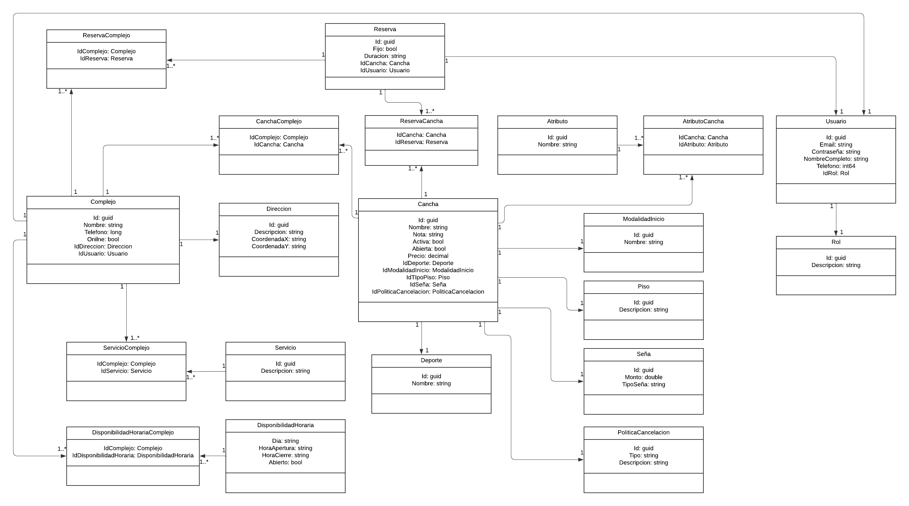

# ReservAR

# Estructura de carpetas y contenido
- Application 
    - CQRS
    - Logica de CU
    - Interfaces de los repositorios
- Presentation 
    - Endpoints
    - Inyecciones de las capas
- Contracts 
    - Requests y Responses models
- Domain 
    - DDD
    - Entidades, agregadores, value objects, entre otros
- Infraestructure 
    - Persistencia con BDD Sql Server
    - Repositorios
    - Conexion a servicios externos

# Arquitectura del proyecto


Fuente: [Clean Architecture with .NET Core: Getting Started](https://jasontaylor.dev/clean-architecture-getting-started/)

# Diagrama de clases


# Para crear las Migraciones y correr la Base de Datos
- Cambiar cadena de conexion
- En la consola de comandos nugget, posicionados en el proyecto ReservAR.Infraestructure
```
Add-Migration InitialMigration -Context ReservarDbContext
Update-Database
```
